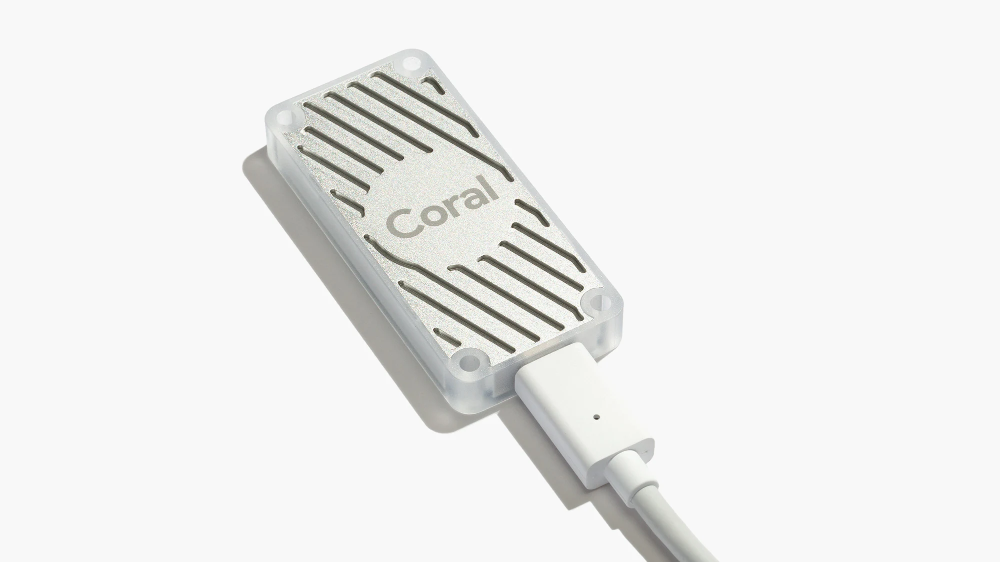
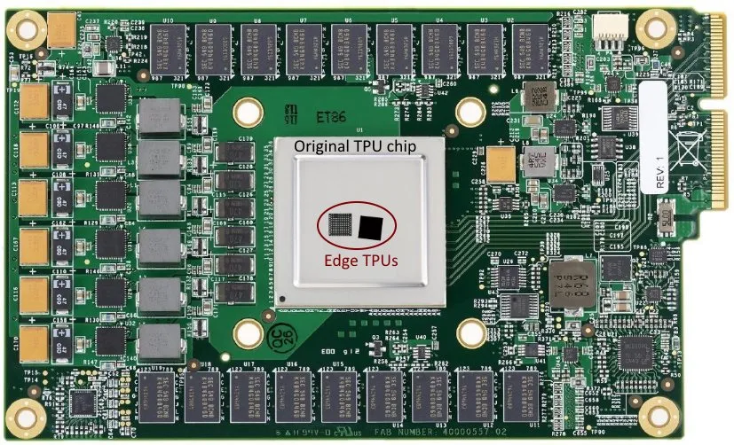

# Compiling Custom Operations of Tensorflow Lite models to run on the Coral Edge TPU USB Hardware Accelerator
The following repository contains the source code for compiling and mapping operations within a Tensorflow Lite model into custom operations to run on Google's Coral Edge TPU USB Accelerator. The project was part of my bachelor's thesis at the Technical University of Munich.

<p align="center">

</p>

# Introduction
As described in their [official website](https://coral.ai/products/accelerator), the Coral USB Accelerator is a hardware device designed by Google to enable the acceleration of Machine Learning models. The USB Accelerator is accustomed with an Application Specific Integration Circuit (ASIC), namely the Edge Tensor Processing Unit which is a chip that is also designed by Google. In fact, the *Edge TPU* is a much smaller version of the original TPU that is used in Google's Cloud Servers. A small comparison of the two chips can be seen in the following picture.

<p align="center">

</p>

The Edge TPU supports only [Tensorflow Lite](https://www.tensorflow.org/lite/guide) models and architectures falling in the category of Artificial Neural Networks. In fact, enjoying what Edge TPU has to offer, in terms of speed and lower power consumptions, comes with a flexibilty trade-off. Tensorflow Lite models need to fulfill a list of requirements that are fully described in the following [link](https://coral.ai/docs/edgetpu/models-intro#model-requirements)

## The issue addressed by this project
In order to be able to run an inference on the Edge TPU, our Tensorflow Lite model needs to be compiled using a tool provided by Coral, the [Edge TPU Compiler](https://coral.ai/docs/edgetpu/models-intro#compiling). However, the Edge TPU Compiler is designed in a way that it either compiles the whole model (by fusing all model operations into one 'edgetpu-custom-op') or, in case an unsupported operation is encoutered, only the upper portion of the model gets compiled. The Edge TPU is only able to execute custom operations that are specifically compiled for it, what forces the uncompiled portion of the model to run on the CPU of the host computer. A more detailed description of the innerworkings of the Edge TPU Compiler can be found in the link above. 

## The solution proposed by this project
The code found in this project solves the compiler issue by converting the Tensorflow Lite model (.tflite) into a JSON (.json) file. The JSON representation of the model is achieved using the [Flatbuffers Compiler](https://google.github.io/flatbuffers/flatbuffers_guide_using_schema_compiler.html), a tool also provided by Google, that allows the conversion of a Flatbuffer (our Tensorflow Lite model) into a JSON format, without losing any parameters or data.
 
# Tools
## Hardware
- Google's Coral Edge TPU USB Accelerator
## Software 
- Docker
- Flatbuffers


# Docker
## Dependencies
```
docker
```

## Installation
Based on an Arch system.

```
sudo pacman -S docker
sudo systemctl enable docker.service
sudo systemctl start docker.service --now
```
### Groups
To enable the use of docker without sudo.
```
sudo usermod -aG docker <user>
```

### Docker Setup
Commands will not contain sudo, since the user has been added to the docker group.

Pull down the debian image.
```
docker pull debian
```

Create and run the debian docker.

Recommended name is **debian-docker** as this is hardcoded in the
scripts to interact and execute tasks within the docker container.
```
docker run --name <docker_name> --privileged -v /dev/bus/usb:/dev/bus/usb -it -d debian
docker start <docker_name>
docker attach <docker_name>
```
Update packages and install/setup the bare *essentials*.
```
apt-get update
apt-get install vim sudo # Vim Long and Prosper
```

Theoretically, one could use the docker as root always, but I had encountered hiccups here
and there when doing so. It could also well be due to my own  mistakes, but using the docker with
a user worked flawlessly.
```
adduser deb # The user is called deb (as in Debian.. lol)
    <create password>

usermod -aG sudo deb

passwd root
    <create password>

login deb
    <insert password>
```
### Tensorflow Lite and Coral Setup
Install project-related packages and tools.

The `Gnupg` package may also not be needed, but Ive encountered issued
without it.
```
sudo apt-get install gnupg curl git python3 python3-pip
```
Installing the coral edge tpu compiler and library. Please review the following [link](https://coral.ai/docs/accelerator/get-started/#1-install-the-edge-tpu-runtime) to check if installing these packages for Ubuntu/Debian has been updated/changed.
```
echo "deb https://packages.cloud.google.com/apt coral-edgetpu-stable main" | sudo tee /etc/apt/sources.list.d/coral-edgetpu.list
curl https://packages.cloud.google.com/apt/doc/apt-key.gpg | sudo apt-key add -

sudo apt-get update
sudo apt-get install libedgetpu1-std edgetpu-compiler
```

### Docker Manual Usage
```
1. docker start <docker_name>
2. docker attach <docker_name>
3. docker info
4. docker images
5. docker ps -a
```
1. Starts docker. 
2. Attaches to it, meaning "ssh's" into the docker installation.
3. Get general information of the dockers within the system.
4. Displays docker images installed (Debian, Arch BTW, etc)
5. Looks at the status of dockers within the systems, useful to visualize if docker has
   started/is stopped.

### Coral Usage
#### Coral 'Hello World'
**Setup:**

Look again [here](https://coral.ai/docs/accelerator/get-started/#1-install-the-edge-tpu-runtime) to ensure this is still the workflow for the *Hello World* for the Coral Edge TPU.
```
mkdir coral && cd coral
git clone https://github.com/google-coral/tflite.git
cd tflite/python/examples/classification
bash install_requirements.sh

sudo pip3 install Pillow
sudo pip3 install tensorflow
sudo apt-get install python3-pycoral
```

**Run:**

```
mkdir coral && cd coral
git clone https://github.com/google-coral/tflite.git
cd tflite/python/examples/classification
bash install_requirements.sh

sudo pip3 install Pillow
sudo pip3 install tensorflow
sudo apt-get install python3-pycoral

python3 classify_image.py \
--model models/mobilenet_v2_1.0_224_inat_bird_quant_edgetpu.tflite \
--labels models/inat_bird_labels.txt \
--input images/parrot.jpg
```
Now wait and see :).

#### Coral Compilation
```
edgetpu_compiler [options] model...
edgetpu_compiler --help

Ex:
    edgetpu_compiler -s path/to/model
```

# Flabuffers
## Dependencies
```
cmake
```

## Building with VCPKG
Based on any Linux system.

```
git clone https://github.com/Microsoft/vcpkg.git
cd vcpkg
./bootstrap-vcpkg.sh
./vcpkg integrate install
./vcpkg install flatbuffers
```
## Flatbuffers Compiler Usage
To convert a `.tflite` file into `.json`, run:
```
flatc -t --strict-json --defaults-json <path/to/schema.fbs> -- <path/to/model.tflite>
```
To convert a `.json` file into `.tflite`, run:
```
flatc -b <path/to/schema.fbs> <path/to/model.json>
```

# How to use this project
## Setup
```
git clone https://github.com/alxhoff/TensorDSE/
cd TensorDSE/deployment/Model Splitting
```
After cloning the repository, make sure to provide the tflite model by placing it inside the `TensorDSE/deployment/Model Splitting/models/source_model/tflite/`directory.

## Run the script
The executable to run has the name `compile_and_map.py` and can be run in the command line as follows:
```
python3 compile_and_map.py -map <path/to/mapping.csv>
```  
